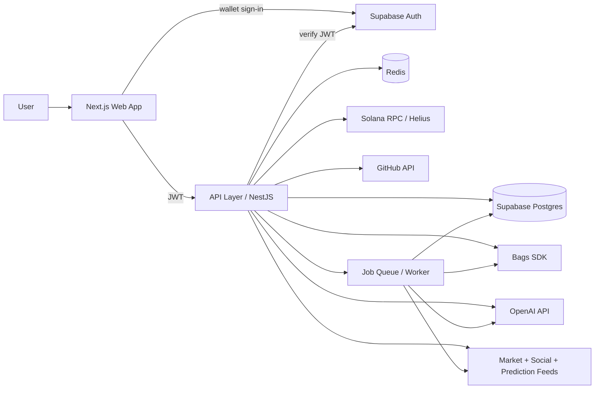

# Architecture Overview

## What We Are Building

bagsMarkets is a multi-surface product that helps users and operators watch, analyze, and act on Bags and Solana market activity.

The system is designed around four ideas:

1. Surface useful intelligence quickly.
2. Make Bags actions executable from the product.
3. Combine market, social, and developer data into shared context.
4. Automate repetitive work with agents and jobs.

## High-Level Shape

The browser talks to Supabase for one thing only: proving wallet ownership at
sign-in. Every read and write of application data goes through the API.

## Core Layers

### Web App

- Public and authenticated product surfaces live in Next.js.
- The web app handles navigation, dashboard views, forms, and operational controls.
- The current scaffold is prepared for shadcn/ui components and analytics instrumentation.

### API Layer

- NestJS is the service boundary for domain logic.
- It verifies the Supabase JWT on every request and resolves it to a profile.
  Supabase issues identity; the API decides what that identity may do.
- It owns request validation, data aggregation, and orchestration into external services.
- It should expose stable contracts to the web app and any future clients.

### Data Layer

- Supabase-hosted PostgreSQL stores wallets, launch metadata, fee-sharing records, alerts, jobs, and analytics-ready domain objects.
- Supabase Auth owns `auth.users`. We do not create or manage that table; our own
  `profiles` table hangs off it by foreign key.
- Drizzle owns the schema definition and generates the SQL migrations. Supabase
  is the host, not the schema authority — there is exactly one migration system.
- pgvector supports semantic retrieval for research, summaries, and similarity matching.
  The extension is enabled up front; no embedding tables exist until there is
  content worth embedding.

### Cache and Jobs

- Redis supports ephemeral state, rate limiting, and short-lived caches.
- BullMQ or Trigger.dev handles longer-running workflows and retries.
- Background jobs should be used for ingestion, monitoring, alerting, and enrichment.

### Integrations

- Bags SDK handles higher-level transaction flows.
- Solana wallet adapter manages wallet connection in the browser.
- `@solana/web3.js` handles lower-level onchain interactions where needed.
- Helius provides RPC access and blockchain data.
- OpenAI powers summarization, classification, and agentic workflows.

## Data Flow

1. A user opens the web app.
2. The web app requests aggregated data from the API.
3. The API reads from Postgres and Redis.
4. The API may trigger jobs or call external services.
5. Background workers ingest and enrich market, social, and developer data.
6. AI services summarize or score the results.
7. The UI displays the combined output with a clear action path.

## Service Boundaries

### Web

- Presentation only
- Minimal business logic
- Uses API contracts

### API

- Auth
- Domain logic
- Third-party integrations
- Job scheduling and orchestration

### Worker

- Feed ingestion
- Enrichment
- Notifications
- Monitoring and retries

## Phase 2 Decisions

These were settled before the schema was written. Each names the trade-off
accepted, so a later reader can tell what was chosen versus what was defaulted.

### Identity is a Solana wallet

Sign-in is wallet-only, through Supabase Auth's `signInWithWeb3` with the Solana
provider. There is no password or OAuth stack.

- **Why:** this is a Solana-native operator tool. Every user has a wallet, so an
  email/password system would be work that serves nobody.
- **Accepted cost:** no wallet, no account. Supabase also notes that Web3
  accounts carry no email or phone, which makes automated signup abuse cheap —
  so CAPTCHA and rate limiting are required before any public launch, not after.
- **Consequence:** `auth.users` rows are created by Supabase. Our `profiles`
  table references them and holds product-owned fields.

### Ownership is per user, enforced twice

Every domain row carries an owning `profile_id`. There is no organization or
team concept yet.

- **Why:** ownership columns are the expensive retrofit; team sharing is not.
  Adding `org_id` later does not require rewriting existing rows.
- **How:** the API always filters by the authenticated user explicitly, *and*
  RLS policies are enabled on every table. The API connects with a privileged
  role, so RLS does not constrain it — the policies exist to contain anything
  that reaches the database by another path.
- **Accepted cost:** two places enforce the same rule, and they can drift. The
  API's own predicate is the one that must be correct; RLS is the backstop.

### Drizzle owns the schema

Drizzle defines the tables and `drizzle-kit` generates SQL migrations, applied
against the Supabase connection string.

- **Why:** typed `vector` columns for pgvector, and SQL-shaped queries that stay
  legible as the joins get wider.
- **Accepted cost:** we do not use Supabase's own migration workflow, so the
  Supabase dashboard is not a safe place to edit schema. Schema changes go
  through Drizzle or they do not happen.

### The web app never queries Postgres

Next server components call the API. They do not open database connections, and
they do not use `supabase-js` for data.

- **Why:** `architecture.md` already put domain logic behind the API boundary.
  Supabase makes direct access tempting precisely because it is easy, which is
  what makes the rule worth stating rather than assuming.
- **The one exception:** the browser uses `supabase-js` to run the wallet
  sign-in handshake and hold the session. That is authentication, not data.

### Shared types are API contracts, not database rows

`packages/types` holds hand-authored request and response types. `packages/db`
holds the Drizzle schema and is consumed only by server-side code.

- **Why:** the shape we store and the shape we serve should be free to diverge.
  Exporting inferred row types to the browser would weld them together and leak
  columns the API never intends to expose.

### pgvector is enabled but unused

The first migration creates the extension. No embedding column exists yet.

- **Why:** enabling an extension in a live database later is a migration nobody
  wants to schedule, but designing an embedding schema before the corpus exists
  guarantees rework. Phase 5 designs it against real content.

## Key Design Decisions

- Split frontend and backend early so the product can scale without entangling UI and orchestration logic.
- Use Postgres as the canonical data source instead of scattering state across services.
- Keep AI in supporting roles and avoid making it the only source of truth.
- Prefer queues and scheduled jobs for tasks that are slow, retryable, or external-system dependent.

## Suggested Future Structure

- `src/` for the Next.js web app
- `apps/api/` for the NestJS service
- `apps/worker/` for background jobs when introduced
- `packages/` for shared types, SDK wrappers, and utilities

