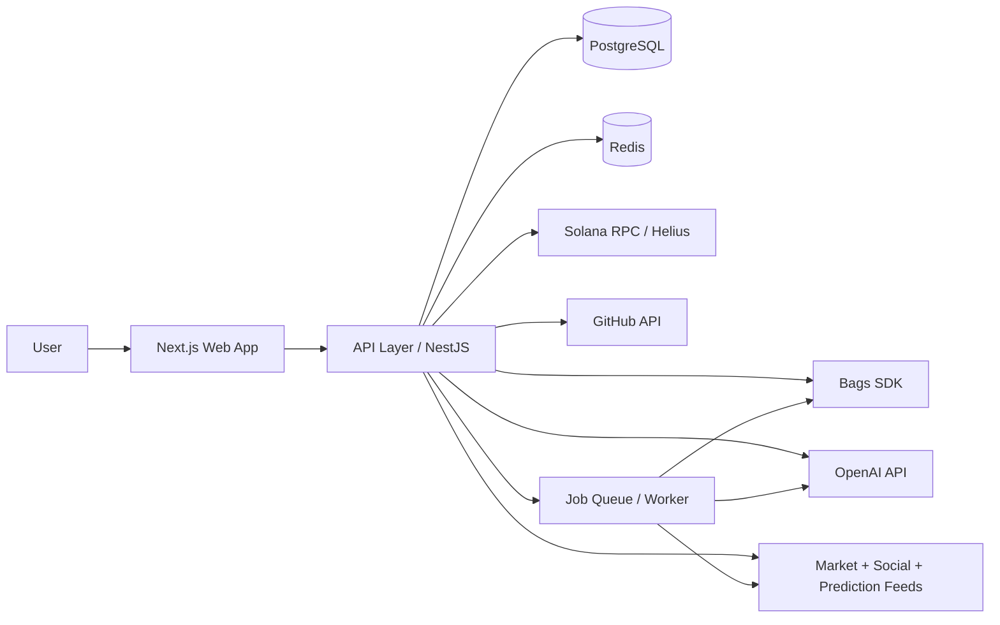

# Architecture Overview

## What We Are Building

bagsMarkets is a multi-surface product that helps users and operators watch, analyze, and act on Bags and Solana market activity.

The system is designed around four ideas:

1. Surface useful intelligence quickly.
2. Make Bags actions executable from the product.
3. Combine market, social, and developer data into shared context.
4. Automate repetitive work with agents and jobs.

## High-Level Shape

## Core Layers

### Web App

- Public and authenticated product surfaces live in Next.js.
- The web app handles navigation, dashboard views, forms, and operational controls.
- The current scaffold is prepared for shadcn/ui components and analytics instrumentation.

### API Layer

- NestJS is the service boundary for domain logic.
- It will own authentication, request validation, data aggregation, and orchestration into external services.
- It should expose stable contracts to the web app and any future clients.

### Data Layer

- PostgreSQL stores users, wallets, launch metadata, fee-sharing records, alerts, jobs, and analytics-ready domain objects.
- pgvector supports semantic retrieval for research, summaries, and similarity matching.

### Cache and Jobs

- Redis supports ephemeral state, rate limiting, and short-lived caches.
- BullMQ or Trigger.dev handles longer-running workflows and retries.
- Background jobs should be used for ingestion, monitoring, alerting, and enrichment.

### Integrations

- Bags SDK handles higher-level transaction flows.
- Solana wallet adapter manages wallet connection in the browser.
- `@solana/web3.js` handles lower-level onchain interactions where needed.
- Helius provides RPC access and blockchain data.
- OpenAI powers summarization, classification, and agentic workflows.

## Data Flow

1. A user opens the web app.
2. The web app requests aggregated data from the API.
3. The API reads from Postgres and Redis.
4. The API may trigger jobs or call external services.
5. Background workers ingest and enrich market, social, and developer data.
6. AI services summarize or score the results.
7. The UI displays the combined output with a clear action path.

## Service Boundaries

### Web

- Presentation only
- Minimal business logic
- Uses API contracts

### API

- Auth
- Domain logic
- Third-party integrations
- Job scheduling and orchestration

### Worker

- Feed ingestion
- Enrichment
- Notifications
- Monitoring and retries

## Key Design Decisions

- Split frontend and backend early so the product can scale without entangling UI and orchestration logic.
- Use Postgres as the canonical data source instead of scattering state across services.
- Keep AI in supporting roles and avoid making it the only source of truth.
- Prefer queues and scheduled jobs for tasks that are slow, retryable, or external-system dependent.

## Suggested Future Structure

- `src/` for the Next.js web app
- `apps/api/` for the NestJS service
- `apps/worker/` for background jobs when introduced
- `packages/` for shared types, SDK wrappers, and utilities

